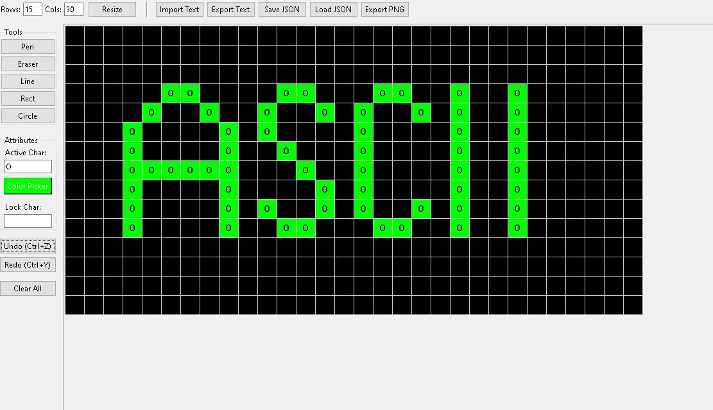

# ascii-pixel-matrix-editor
Advanced Pixel Matrix Editor built with Python Tkinter. Supports shapes, undo/redo, JSON, PNG export.
# Pixel Matrix Editor Pro

Advanced grid-based pixel editor built with Python Tkinter.

## Features
- Pen / Eraser
- Line, Rectangle, Circle tools
- Undo / Redo
- Lock character mode
- JSON save/load
- PNG high resolution export
- Text import/export

## Requirements
Python 3.10+
pip install pillow

## Run
python ascii-pixel-matrix-editor.py

## Screenshot

